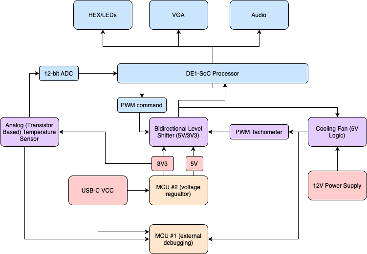
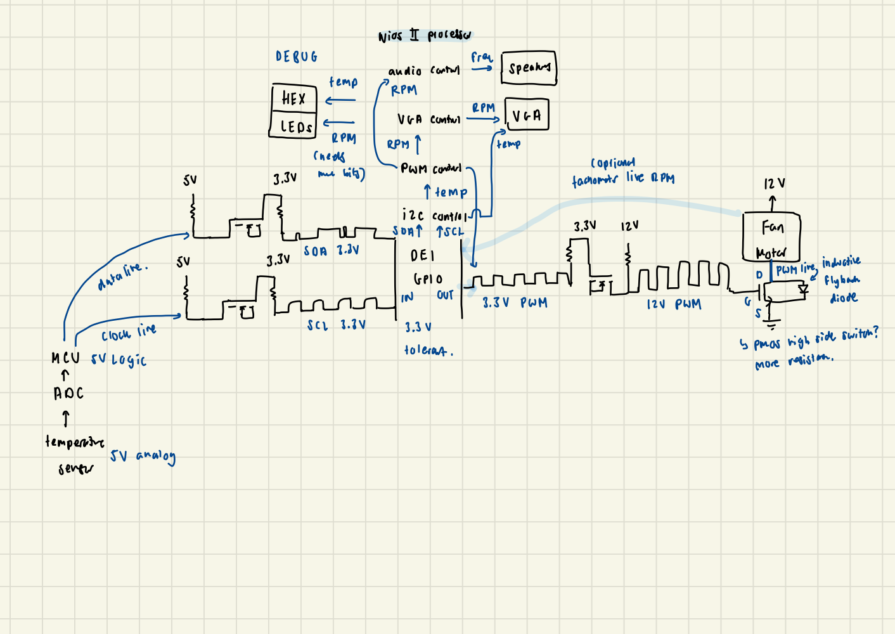
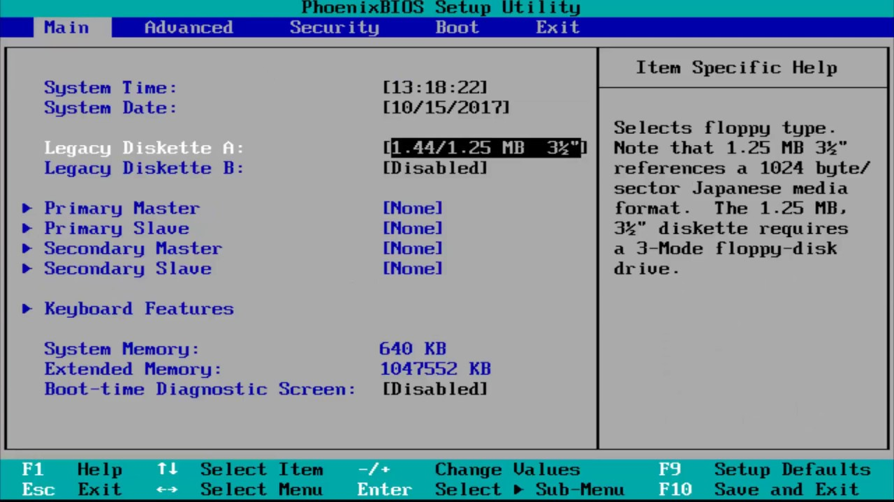

# Bios Settings
> HW/SW Emulation of Windows ~~Bios~~ Nios Settings in Nios II Architecture

- `-mcustom-fpu-cfg=60-2` - pass this to the C compiler to allow floating point hardware support
- Exceptions when creating the project
### Systems Architecture

### Schematic Revision 1

## Notes for the demo
- Oscilloscope must be grounded to internal DE1 ground, not the voltage reg or power supply ground
- Configure blink LED to ensure voltage reg is on 
## TODO
- VGA driver (Annie)
    - ~~Assume given input of fan speed and temperature, continually update as they increase/decrease on the VGA~~
    - ~~UI similar to Utility Settings~~
    - If time, real-time line graph that shows temperature and RPM changing overtime
    - ~~Working on CPUlator~~

- Audio driver (Annie)
    - The faster the RPM, the higher the frequency 
- ~~Analog sensor read to MCU (Samar)~~
- ~~ADC sensor read to DE1-SoC~~ (Samar)
    - ~~Temperature reading on the HEX display~~
    - ~~Figure out scaled calibration of the sensor~~
- ~~Test level shifter with 5V (Samar)~~
- ~~Fan spinning with PWM DE1-SoC 5V~~ (Samar) 
    - ~~RPM on the LEDs (map 6100 RPM to 1023 bits)~~
    - ~~If time, convert the hardware timer code to use interrupts~~
    - ~~PWM signal from DE1-SoC working at 5V with motor (Samar)~~
- Motor and temp sensor integrated (Samar)
- Full integration (Samar)
    - Decide if we want multiple C files or just one `main.c`
- Program separate MCU and short the incoming tach signal to it so we can have 10 LEDs showing current fan speed (Samar)
- ~~Fan spinning with PWM MCU @ 5V (Samar)~~
- ~~Get power supply/boost converter (thank you Hamid)~~
- ~~Get cooling fan (Samar)~~
- ~~Look for cooling fan (Annie)~~
- ~~Batteries in multimeter~~
## Working Commits
- `fdb939e` has the 50% PWM signal with SW timer
- `264edbc` has the 50% PWM signal with HW timer and interrupts
- **`fc8e9b2` has the working temperature and motor integration**
- **`36dd0b3` has full intgeration (bug with character buffer clearing)**
## Datasheets
- [PWM controlled fan (9GA0812P7G001)](https://www.mouser.ca/datasheet/2/471/San_Ace_80GA15_E-1360952.pdf)
- [Temperature sensor (TMP36)](https://www.analog.com/media/en/technical-documentation/data-sheets/tmp35_36_37.pdf)
## Parts to buy/acquire
- Temperature sensor
    - [LilyPad one](https://www.creatroninc.com/product/lilypad-temperature-sensor/)
- Cooling fan
    - [12V DC brushless fan](https://www.creatroninc.com/product/12v-dc-brushless-fan-70x70x15mm/)
    - [PWM controlled](https://www.amazon.ca/Bearing-Cooling-NF-R8-Redux-1800-PWM/dp/B00KF7MVI2/ref=sr_1_11?crid=1P4D6WT2IIFVQ&dib=eyJ2IjoiMSJ9.LCkOiKCAN0PlHaIEkQb9OIFngdNSCuJjopA5aoWmUmJ89cVuPap5ubERcnirQBAh6XfE1XjtYVZiEPdCbVyRrE6zRtgmSFwz5JSy5OBSFyyP--tll3UJmEtxWPW9B3IseQmLCFMMpoY9Jb31b5BFdRcgVdg8_Bms4zxgq1B-iaCesThI9PF-Sq_RAqFxzysHYwlsYgc-hhJcyWfSDO5zbHlkE-Tc9OKJ8kgiDznLsP83j0EVgPR_Lkgd5LrDeEhLGlBhJY32CjsgOctRkKHZKxp3uePUwPp5vgZ-S3XIx8E.YzjD5qlG6fRc5XemmJiSypQoqBXmCtfdht6n3tFCCXk&dib_tag=se&keywords=pwm+cooling+fan&qid=1710369658&sprefix=pwm+cooling+fan%2Caps%2C94&sr=8-11)
- FET and flyback to drive the motor (Myfab)

https://www.canva.com/design/DAGByrgro00/HB6Eb61NtkFlg6IMMjyVEw/edit